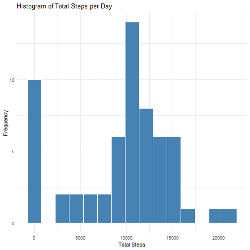
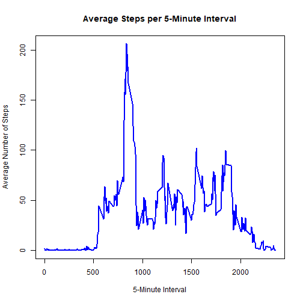
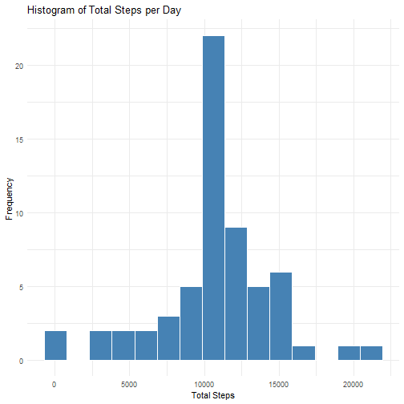
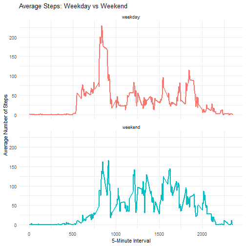

## Loading and preprocessing the data


``` r
library(tidyverse)
library(ggplot2)
data<-read.csv("activity.csv")
summary(data)
```

```
##      steps            date              interval     
##  Min.   :  0.00   Length:17568       Min.   :   0.0  
##  1st Qu.:  0.00   Class :character   1st Qu.: 588.8  
##  Median :  0.00   Mode  :character   Median :1177.5  
##  Mean   : 37.38                      Mean   :1177.5  
##  3rd Qu.: 12.00                      3rd Qu.:1766.2  
##  Max.   :806.00                      Max.   :2355.0  
##  NA's   :2304
```

``` r
data$date <- as.Date(data$date, format="%Y-%m-%d") # chuyển sang cột date sang dạng date
```

## What is mean total number of steps taken per day?


``` r
library(ggplot2)
#tạo bảng data mới để xử lý
sum_steps_date <- data %>%
  group_by(date) %>% 
  summarize(sum_steps = sum(steps, na.rm = TRUE)) 
#vẽ biểu đồ
ggplot(sum_steps_date, aes(x = sum_steps)) +
  geom_histogram(fill = "steelblue", color = "white", bins = 15) +
  labs(
    title = "Histogram of Total Steps per Day",
    x = "Total Steps",
    y = "Frequency"
  ) +
  theme_minimal() 
```



``` r
# Tính toán giá trị
mean_steps <- mean(sum_steps_date$sum_steps, na.rm = TRUE)
median_steps <- median(sum_steps_date$sum_steps, na.rm = TRUE)

# Báo cáo kết quả ra màn hình (Console)
print(paste("Mean (Trung bình):", mean_steps))
```

```
## [1] "Mean (Trung bình): 9354.22950819672"
```

``` r
print(paste("Median (Trung vị):", median_steps))
```

```
## [1] "Median (Trung vị): 10395"
```

## What is the average daily activity pattern?


``` r
#tạo bảng data mới để xử lý, trong đó tính trung bình số steps theo từng 5 phút một
avg_steps_interval <- data %>%
  group_by(interval) %>% 
  summarize(avg_steps = mean(steps, na.rm = TRUE))
#vẽ biểu đồ đườg với trục x là mỗi 5 phút, y là trung bình số bước
plot(
  x = avg_steps_interval$interval, 
  y = avg_steps_interval$avg_steps, 
  type = "l",                            # Chữ "l" (line) để vẽ biểu đồ đường
  col = "blue",                          # Màu sắc của đường
  lwd = 2,                               # Độ dày của đường
  main = "Average Steps per 5-Minute Interval",
  xlab = "5-Minute Interval",
  ylab = "Average Number of Steps"
)
```



``` r
#tìm số bước lớn nhất trong khoảng thời gian 5 phút
khoang_thoi_gian_max <- avg_steps_interval %>%
  filter(avg_steps == max(avg_steps))

# In kết quả ra màn hình
print(khoang_thoi_gian_max)
```

```
## # A tibble: 1 × 2
##   interval avg_steps
##      <int>     <dbl>
## 1      835      206.
```

##Imputing missing values

``` r
# Đếm tổng số dòng bị khuyết dữ liệu
tong_so_hang_na <- sum(!complete.cases(data))

print(tong_so_hang_na)
```

```
## [1] 2304
```

``` r
# tạo bảng mới bằng cách điền giá trị trung bình trong khoảng thời gian 5 phút

data_final <- data %>%
  # 1. Ghép cột trung bình (avg_steps) vào bảng gốc dựa trên mã interval
  left_join(avg_steps_interval, by = "interval") %>%
  
  # 2. Lấp NA: Lấy giá trị cột steps, nếu steps là NA thì lấy avg_steps đắp vào
  mutate(steps = coalesce(steps, avg_steps)) %>%
  
  # 3. Dọn dẹp: Xóa cột avg_steps đi để bảng mới y hệt cấu trúc bảng gốc (3 cột)
  select(-avg_steps)

# Kiểm tra xem còn dòng NA nào không
sum(is.na(data_final$steps))
```

```
## [1] 0
```

``` r
#tạo bảng data mới để xử lý
sum_steps_date_final <- data_final %>%
  group_by(date) %>% 
  summarize(sum_steps = sum(steps, na.rm = TRUE)) 
#vẽ biểu đồ
ggplot(sum_steps_date_final, aes(x = sum_steps)) +
  geom_histogram(fill = "steelblue", color = "white", bins = 15) +
  labs(
    title = "Histogram of Total Steps per Day",
    x = "Total Steps",
    y = "Frequency"
  ) +
  theme_minimal() 
```



``` r
# Tính toán giá trị
mean_steps <- mean(sum_steps_date_final$sum_steps, na.rm = TRUE)
median_steps <- median(sum_steps_date_final$sum_steps, na.rm = TRUE)

# Báo cáo kết quả ra màn hình (Console)
print(paste("Mean (Trung bình):", mean_steps))
```

```
## [1] "Mean (Trung bình): 10766.1886792453"
```

``` r
print(paste("Median (Trung vị):", median_steps))
```

```
## [1] "Median (Trung vị): 10766.1886792453"
```
## Are there differences in activity patterns between weekdays and weekends?

``` r
#Tạo cột phân loại (day_type)
du_lieu_cuoi_cung <- data_final %>%
  mutate(
    # Lấy tên thứ (Lưu ý: Nếu R của bạn dùng tiếng Việt, hãy đổi "Saturday", "Sunday" thành "thứ bảy", "chủ nhật")
    ten_thu = weekdays(date),
    
    # Phân loại thành weekend hoặc weekday
    day_type = ifelse(ten_thu %in% c("Saturday", "Sunday"), "weekend", "weekday"),
    
    # Ép kiểu sang dạng Factor theo yêu cầu
    day_type = as.factor(day_type)
  )

#Tính trung bình và vẽ biểu đồ (Panel plot)
# Tính trung bình theo 2 nhóm: interval và day_type
trung_binh_kieu_ngay <- du_lieu_cuoi_cung %>%
  group_by(interval, day_type) %>%
  summarize(avg_steps = mean(steps), .groups = "drop")

# Vẽ biểu đồ với facet_wrap để chia làm 2 khung hình
ggplot(trung_binh_kieu_ngay, aes(x = interval, y = avg_steps, color = day_type)) +
  geom_line(linewidth = 1) +
  facet_wrap(~day_type, nrow = 2) + # Lệnh này tạo ra Panel Plot (2 biểu đồ xếp chồng)
  labs(
    title = "Average Steps: Weekday vs Weekend",
    x = "5-Minute Interval",
    y = "Average Number of Steps"
  ) +
  theme_minimal() +
  theme(legend.position = "none") # Ẩn chú giải vì tiêu đề khung đã ghi rõ
```



